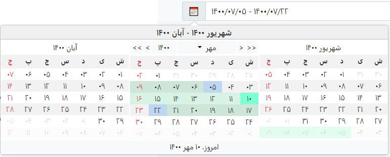
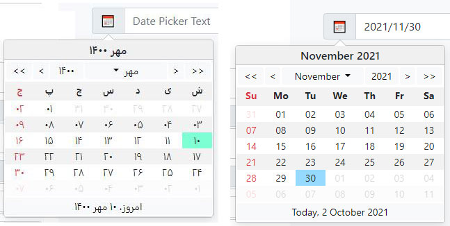

# MD.BootstrapPersianDateTimePicker
#### Bootstrap 5+ Persian And Gregorian Date Time Picker

Major changes:
1. Using Bootstrap 5
2. jQuery Removed
3. Rewrite all codes, better performance





[Demo](demo/demo.html)

### Installing:
First you have to install `Bootstrap 5` and link it to your html file.

Then you can install latest version of the library via npm:

***npm install md.bootstrappersiandatetimepicker@latest***

Now add these files to you html:
```html
<link href="/dist/mds.bs.datetimepicker.style.css" rel="stylesheet"/>
<script src="/dist/mds.bs.datetimepicker.js"></script>
```
##### NOTE:
This library css file must be after bootstrap css file

I suggest to add scripts at the end of  `body`  tag and after  `bootstrap` js file.
### How to use:
```javascript
const dtp1Instance = new mds.MdsPersianDateTimePicker(document.getElementById('dtp1'), {
  targetTextSelector: '[data-name="dtp1-text"]',
  targetDateSelector: '[data-name="dtp1-date"]',
});
```

<hr>

### Options:
Default values are into `[ ]`

Name | Values | Description | Sample
------------- | ------------- | ------------- |-------------
**placement** | top, right, [bottom], left | Position of date time picker 
**trigger** | [click], mouse down, focus, ... | Event to show date time picker 
**enableTimePicker** | [false], true | Time picker visibility 
**targetTextSelector** | String | CSS selector to show selected date as `format` property into it | '#TextBoxId'
**targetDateSelector** | String | CSS selector to save selected date into it | '#InputHiddenId'
**toDate** | [false], true | When you want to set date picker as `toDate` to enable date range selecting 
**fromDate** | [false], true | When you want to set date picker as `fromDate` to enable date range selecting
**groupId** | String | When you want to use `toDate`, `fromDate` you have to enter a group id to specify date time pickers| 'dateRangeSelector1'
**disabled** | [false], true | Disable date time picker 
**textFormat** | String | format of selected date to show into `targetTextSelector` | 'yyyy/MM/dd HH:mm:ss'
**dateFormat** | String | format of selected date to save into `targetDateSelector` | 'yyyy/MM/dd HH:mm:ss'
**calendarSystem** | [jalali], gregorian, islamic | Calendar system used for rendering and selection | 'islamic'
**isGregorian** | [false], true | Is calendar Gregorian 
**inLine** | [false], true | Is date time picker in line 
**modalMode** | [false], true | Open in modal mode, suitable for smart phones
**selectedDate** | [undefined], Date | Selected date as JavaScript Date object | new Date('2018/9/30')
**selectedDateToShow** | [new Date()], Date | Selected date to start calendar from it as JavaScript Date object | new Date('2018/9/30')
**selectedRangeDate** | Array: Date[] | Selected range date as JavaScript Date object | [new Date('2020/8/5'), new Date('2020/8/15')]
**yearOffset** | Number | Number of years to select in year selector | 30
**holidays** | Array: Date[] | Array of holidays to show in date time picker as holiday | [new Date(), new Date(2017, 3, 2)]
**disabledDates** | Array: Date[] | Array of disabled dates to prevent user to select them | [new Date(2017, 1, 1), new Date(2017, 1, 2)] 
**specialDates** | Array: Date[] | Array of dates to mark some dates as special | [new Date(2017, 2, 1), new Date(2017, 3, 2)] 
**disabledDays** | Array: number[] | Array of disabled week days to prevent user to select them | Disable all "Thursday", "Friday" in persian [ 5, 6 ]
**disableBeforeToday** | [false], true | Disable days before today 
**disableAfterToday** | [false], true | Disable days after today 
**disableBeforeDate** | Date | Disable days before this Date | new Date(2018, 11, 12) 
**disableAfterDate** | Date | Disable days after this Date | new Date(2018, 12, 11) 
**rangeSelector** | [false], true | Enables rangeSelector feature on date time picker
**monthsToShow** | Numeric array with 2 items, [0 ,0] | To show, number of month before and after selected date in date time picker, first item is for before month, second item is for after month | [1, 1]
**persianNumber** | [false], true | Convert numbers to persian characters | 
**calendarViewOnChange(date)** | function | Event fires on date picker's view change
**onDayClick(event)** | function | Event fires on day cell click

<hr>

### String format:

Format | English Description | Pashto Description
------------- | ------------- | -------------
**yyyy** | Year, 4 digits | کال، څلور رقمي
**yy** | Year, 2 digits | کال، دوه رقمي
**MMMM** | Month name | د مياشتې نوم
**MM** | Month, 2 digits | د مياشتې دوه رقمي شمېره
**M** | Month, 1 digit | د مياشتې يو رقمي شمېره
**dddd** | Week day name | د اوونۍ د ورځې نوم
**dd** | Month's day, 2 digits | د ورځې دوه رقمي شمېره
**d** | Month's day, 1 digit | د ورځې يو رقمي شمېره
**HH** | Hour, 2 digits - 0 - 24 | د ساعت دوه رقمي شمېره، له 0 تر 24
**H** | Hour, 1 digit - 0 - 24 | د ساعت يو رقمي شمېره، له 0 تر 24
**hh** | Hour, 2 digits - 0 - 12 | د ساعت دوه رقمي شمېره، له 0 تر 12
**h** | Hour, 1 digit - 0 - 12 | د ساعت يو رقمي شمېره، له 0 تر 12
**mm** | Minute, 2 digits | د دقیقې دوه رقمي شمېره
**m** | Minute, 1 digit | د دقیقې يو رقمي شمېره
**ss** | Second, 2 digits | د ثانیې دوه رقمي شمېره
**s** | Second, 1 digit | د ثانیې يو رقمي شمېره
**tt** | AM / PM | غ.م يا غ.و
**t** | A / P | د غ.م يا غ.و لومړی توری

<hr>

### Functions:

Name | Return Value | Description | Sample
------------- | ------------- | ------------- |-------------
**show** | void | show date picker | dtp1Instance.show()
**hide** | void | hide date picker | dtp1Instance.hide()
**toggle** | void | show or hide date picker | dtp1Instance.toggle()
**enable** | void | enable date picker  | dtp1Instance.enable()
**disable** | void | disable date picker | dtp1Instance.disable()
**updatePosition** | void | update position of date picker | dtp1Instance.updatePosition()
**updateSelectedDateText** | void | update `targetTextSelector` text | dtp1Instance.updateSelectedDateText()
**dispose** | void | dispose date picker | dtp1Instance.dispose()
**getBsPopoverInstance** | bootstrap.Popover | return instance of bootstrap popover | const bsPopover = dtp1Instance.getBsPopoverInstance()
**getBsModalInstance** | bootstrap.Modal | return instance of bootstrap modal | const bsModal = dtp1Instance.getBsModalInstance()
**updateOption** | void | update one option of date picker | dtp1Instance.updateOption('isGregorian', false)
**updateOptions** | void | update one option of date picker | dtp1Instance.updateOptions({ isGregorian: false, inLine: false, ... })
**getInstance** | MdsPersianDateTimePicker | static method, get instance of MdsDatePicker by an element obj | const jalaliObj = mds.MdsPersianDateTimePicker.getInstance(document.getELementById('IdOfElement'));
**getText** | string | Get selected date text | const txt = dtp1Instance.getText()
**getDate** | Date | Get selected date | const dateObj = dtp1Instance.getDate()
**getDateRange** | [fromDate, toDate]: Date[] | Get selected date range | dtp1Instance.getDateRange();
**setDate** | void | Set selected datetime with Date object argument | dtp1Instance.setDate(new Date('2021/09/22'));
**setDatePersian** | void | Set selected datetime with Date object argument | dtp1Instance.setDatePersian(1400, 06, 31);
**setDateIslamic** | void | Set selected datetime with Islamic date parts | dtp1Instance.setDateIslamic(1447, 11, 13);
**setDateRange** | void | Set selected datetime range with Date object argument | dtp1Instance.setDateRange(new Date('2021/09/04'), new Date('2021/09/22'));
**clearDate** | void | clear selected date | dtp1Instance.clearDate();
**convertDateToString** | string | utility & static method, convert date object to string | const dateStr = mds.MdsPersianDateTimePicker.convertDateToString(date: new Date(), isGregorian: false, format: 'yyyy/MM/dd');
**convertDateToJalali** | json | utility & static method, convert date object to Jalali | const jalaliObj = mds.MdsPersianDateTimePicker.convertDateToJalali(new Date());
**convertDateToIslamic** | json | utility & static method, convert date object to Islamic | const islamicObj = mds.MdsPersianDateTimePicker.convertDateToIslamic(new Date());
**convertDateToStringByCalendar** | string | utility & static method, convert date object to string for a specific calendar system | const txt = mds.MdsPersianDateTimePicker.convertDateToStringByCalendar(new Date(), 'islamic', 'yyyy/MM/dd', true);

<hr>

### Events:

`MD.BootstrapPersianDateTimePicker` uses Bootstrap's popover and modals. so you can use `popover` or `modal` events.

https://getbootstrap.com/docs/5.1/components/popovers/#events
https://getbootstrap.com/docs/5.1/components/modal/#events

<hr>

### Backend:

If you are using .NET in your backend, use your preferred Persian date/time library to handle server-side conversions.
